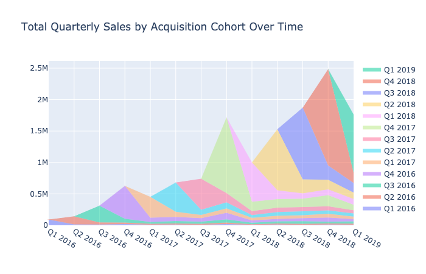
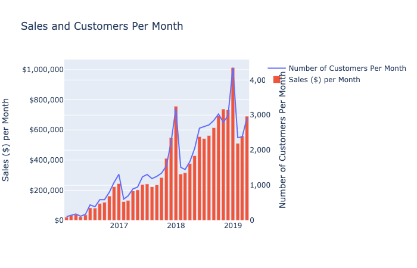
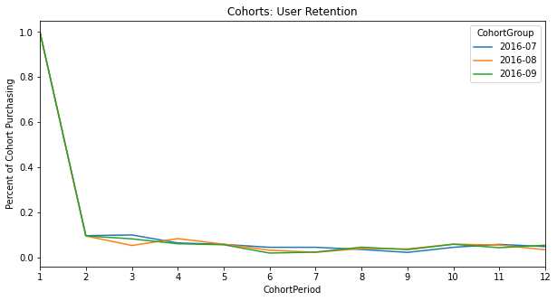
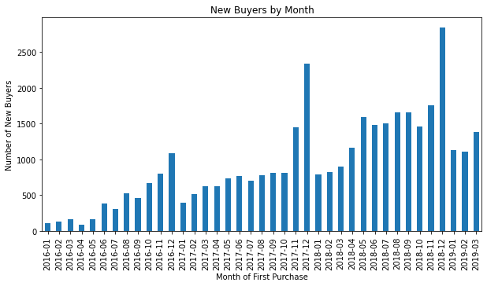

# Lifestream

Lifestream is a Python library to make sense out of your transaction logs. Import a log of your transactional data and let's explore! 



## Installation

Use the package manager [pip](https://pip.pypa.io/en/stable/) to install lifestream.

```bash
pip install lifestream
```
## Transactional Data 
At a minimum, the transactional data you import should have the following: 

* OrderID assoiated with transaction
* Unique user id associated with transaction
* Date of transaction
* Monetary value of transaction


| order_id | user_id | date       | monetary_value |
|----------|---------|------------|----------------|
| 768      | 13      | 09/13/2020 | $15.12        |
| 769      | 13249   | 09/13/2020 | $240.00        |
| 770      | 11424   | 09/13/2020 | $194.34        |

*Is your transactional data in another kind of format? See the `create_transaction_log` function below.*

## Usage
This library is inspired by [many of the charts found in this PowerPoint file](https://www.dropbox.com/s/x7b7e1kq7gk9id1/summarizing%20buyer%20behavior%20in%20excel%20clean.pptx?dl=0) created by [Prof Daniel McCarthy](https://twitter.com/d_mccar/status/1299972436117643264). 

Below are some of the methods found within this library. *Not all methods are in the readme, so open-up the lifestream.py file for some Easter eggs.*

### Transaction Log Creation
Need to create a transaction log that meets the library's requirements? If your data is as raw as the individually purchased items, try this method.

```python

lifestream.create_transaction_log(df, orderid_col, datetime_col customerid_col, quantity_col, 
unitprice_col)
```
* **df** is a dataframe of your  data.
* **orderid_col** the column in df DataFrame that denotes the unique order_id.
* **datetime_col** the column in df DataFrame that denotes the datetime the purchase was made.
* **customerid_col** the column in df DataFrame that denotes the unique customer_id.
* **quantity_col** the column in df DataFrame that denotes the quantity of items purchased in an order.
* **unitprice_col** the column in df DataFrame that denotes the unit price of items purchased in an order.

### Monthly Sales Chart
Want to plot sales by month?
```python
import lifestream

lifestream.sales_chart(transaction_log, datetime_col, ordervalue_col, customerid_col, customer_count = True, title = 'Sales and Customers Per Month', ylabel1 = 'Number of Customers Per Month', ylabel2 = 'Sales ($) per Month')
```
* **transaction_log** is a dataframe of your transactional data.
* **datetime_col** represents the column of the transaction_log dataframe which contains the datetime of the transaction.
* **orderid_col** represents the column of the transaction_log dataframe which contains the monetary value of the transaction. 
* **customerid_col** represents the column of the transaction_log dataframe which contains the unique user id associated with the transaction. 
* **customer_count** *optional* boolean to indicate whether overlay of new customers per month is desired
* **title** *optional* represents the title of the chart.
* **ylabel1** *optional* represents the label on the y-axis of the line chart.
* **ylabel2** *optional* represents the label on the y-axis of the bar chart.



### Cohort Retention Chart
Want to dig into basic cohort analyses? Plot how many users from a cohort are still spending in subsequent months.
```python

lifestream.cohort_retention_chart(transaction_log, datetime_col, customerid_col, ordervalue_col, cohort1, cohort2, cohort3, title, ylabel)
```
* **transaction_log** is a dataframe of your transactional data.
* **datetime_col** represents the column of the dataframe which contains the datetime of the transaction.
* **customerid_col** represents the column of the dataframe which contains the unique user id associated with the transaction. 
* **ordervalue_col** represents the column of the dataframe which contains the monetary value of the transaction. 
* **cohort1**, **cohort2**, **cohort3** are the three cohorts you are interested in, expressed as 'YYYY-MM' string.
* **title** *optional* is the title for the plot.
* **ylabel** *optional* is the label for the y-axis of the plot.



### Monthly Acquisition Chart
Plot how many new users you are acquiring per month.

```python

lifestream.new_customers_chart(transaction_log, datetime_col, customerid_col, title, xlabel, ylabel, kind)
```
* **transaction_log** is a dataframe of your transactional data.
* **datetime_col** represents the column of the dataframe which contains the datetime of the transaction.
* **customerid_col** represents the column of the dataframe which contains the unique user id associated with the transaction. 
* **title** *optional* represents the title of the chart.
* **xlabel** *optional* represents the x-axis of the chart.
* **ylabel** *optional* represents the y-axis of the chart.
* **kind** *optional* represents the kind of chart. see the pandas library documentation for the plot method to understand what is available.



### The C3 Chart 🤩

```python

lifestream.c3chart(transaction_log, customer_id, datetime_col, ordervalue_col, title="Total Quarterly Sales by Acquisition Cohort Over Time")
```
* **transaction_log** is a dataframe of your transactional data.
* **customerid_col** represents the column of the dataframe which contains the unique user id associated with the transaction. 
* **datetime_col** represents the column of the dataframe which contains the datetime of the transaction.
* **ordervalue_col** represents the column of the dataframe which contains the monetary value of the transaction. 
* **title** *optional* represents the title of the chart.


## Contributing
Pull requests are welcome. For major changes, please open an issue first to discuss what you would like to change.

## License
[MIT](https://choosealicense.com/licenses/mit/)
